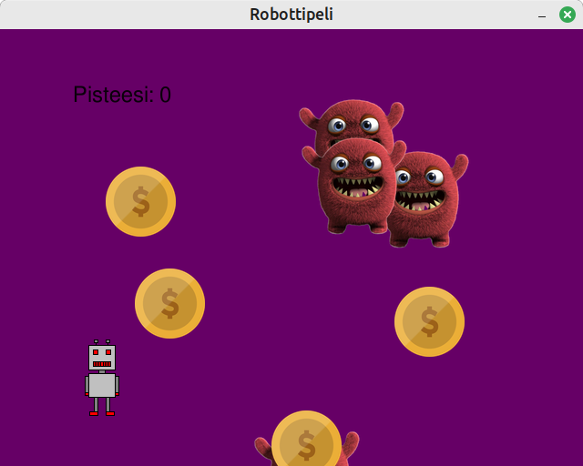

# Ohja-robottipeli

Tein pelin Ohjelmoinnin jatkokurssin tehtävään. Siinä robottia liikutellaan vasemmalle ja
oikealle, tavoitteena syödä kolikoita ja kerätä näin pisteitä. Hirviöön osumisesta peli loppuu.

